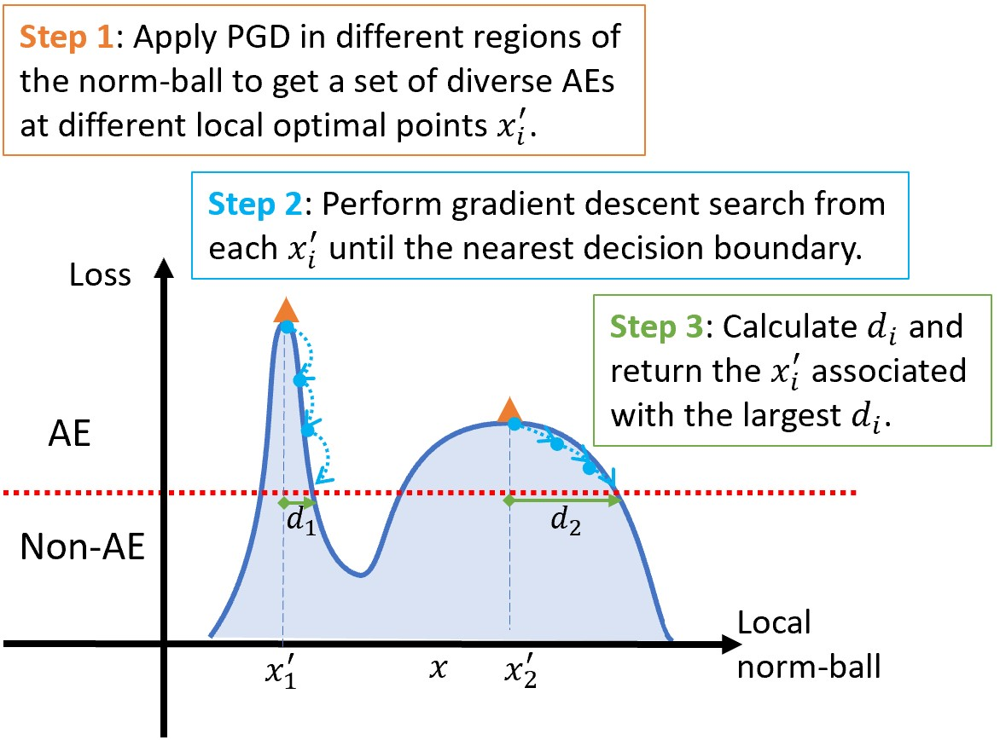
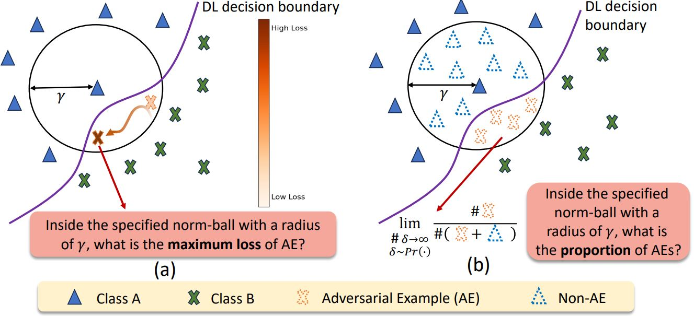
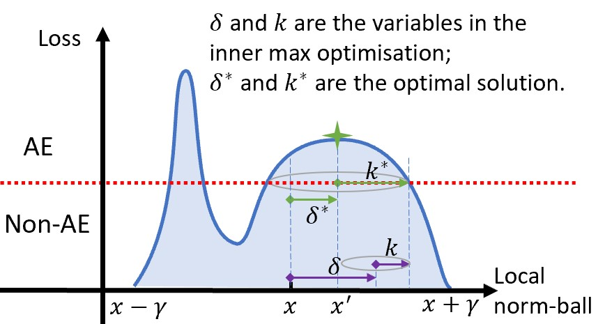
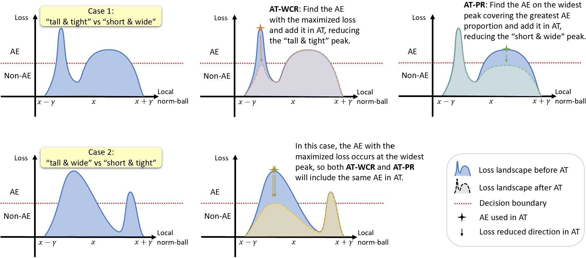
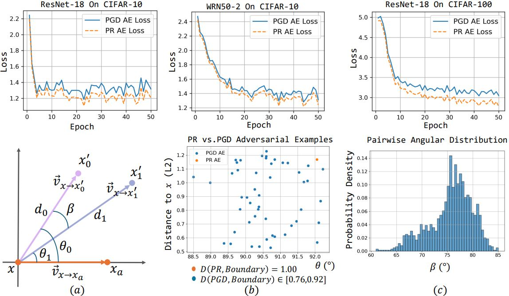
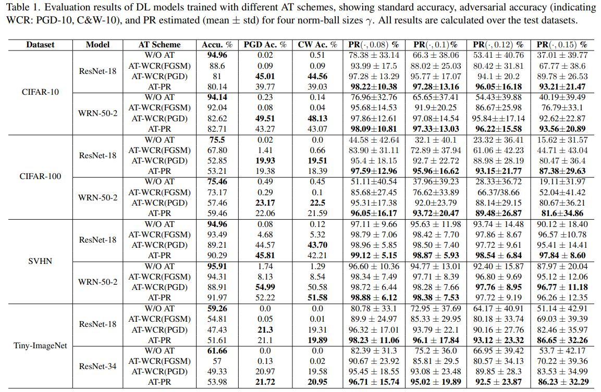

# Adversarial Training for Probabilistic Robustness
[](https://openreview.net/forum?id=eFUSbP7YQa)


> [Yi Zhang](https://scholar.google.com/citations?user=9E8XJ54AAAAJ&hl=en), [Xingyu Zhao*](https://scholar.google.com/citations?user=SzEBdA8AAAAJ&hl=en), [Yuhang Chen](https://scholar.google.co.uk/citations?hl=en&user=gDYhywIAAAAJ), [Zhen Chen](https://scholar.google.com/citations?user=Ezm8UAQAAAAJ&hl=en), [Wenjie Ruan](https://scholar.google.com/citations?hl=en&user=VTASFGEAAAAJ),
[Xiaowei Huang](https://scholar.google.com/citations?user=X4fLCCIAAAAJ&hl=en),
[Siddartha Khastgir](https://scholar.google.com/citations?hl=en&user=r3ldU6sAAAAJ)
>
> *Corresponding Author

We introduced a novel adversarial training (AT) method targeting probabilistic robustness (PR), called AT-PR. By reformulating a new min-max optimization, we laid the theoretical foundation for AT-PR and developed specialized numerical algorithms to solve this optimization. 

## 🔥 News

- [2025/25/06] Our work has been accepted by International Conference on Computer Vision, ICCV 2025 !


## Overview of AT-PR

<p align="center">
    
</p>

## Abstract
 Deep learning (DL) has shown transformative potential across industries, yet its sensitivity to adversarial examples (AEs) limits its reliability and broader deployment. Research on DL robustness has developed various techniques, with adversarial training (AT) established as a leading approach to counter AEs. Traditional AT focuses on worst-case robustness (WCR), but recent work has introduced probabilistic robustness (PR), which evaluates the proportion of AEs within a local perturbation range, providing an overall assessment of the model's local robustness and acknowledging residual risks that are more practical to manage. However, existing AT methods are fundamentally designed to improve WCR, and no dedicated methods currently target PR. To bridge this gap, we reformulate a new min-max optimization as the theoretical foundation for AT focused on PR, and introduce an AT-PR training scheme with effective numerical algorithms to solve the new optimization problem. Our experiments, based on 70 DL models trained on common datasets and architectures, demonstrate that AT-PR achieves higher improvements in PR than AT-WCR methods and shows more consistent effectiveness across varying local inputs, with a smaller trade-off in model generalization. 


## PR vs. WCR
<p align="center">
    
</p>


## New inner-max optimization 
<p align="center">
    
</p>


## Comparison between AT-WCR and AT-PR
<p align="center">
    
</p>


## Visialization of AE from AT-PR and PGD
<p align="center">
    
</p>


## Installation
The code has been tested with the following environment:
```angular2html
git clone https://github.com/wellzline/AT-PR.git
conda env create --name AT-PR
source activate AT-PR
pip install -r requirement.txt
```


### Run
```angular2html
python main.py \
    --dataset CIFAR10 \
    --data_root ./dataset/cifar_10 \
    --model_name resnet18 \
    --input_size 32 \
    --model_depth 28 \
    --model_width 10 \
    --num_class 10 \
    --lr 0.1 \
    --batch_size 256 \
    --weight_decay 5e-4  \
    --epochs 100 \
    --save_path output_model/cifar10_res18/AT_Clean \
    --attack Clean \
    --attack_steps 10 \
    --attack_eps 8.0 \
    --attack_lr 2 \
    --phase train \
    --beta 6.0 
```

## Experiment Result
<p align="center">
    
</p>


## Citation
If you find this repo useful, please cite:
```
@article{zhang2024protip,
  title={Adversarial Training for Probabilistic Robustness},
  author={Yi Zhang, Yuhang Chen, Zhen Chen, Wenjie Ruan, Xiaowei Huang, Siddartha Khastgir, Xingyu Zhao},
  booktitle={International Conference on Computer Vision, ICCV 2025},
  year={2025},
  organization={Springer}
}

```


